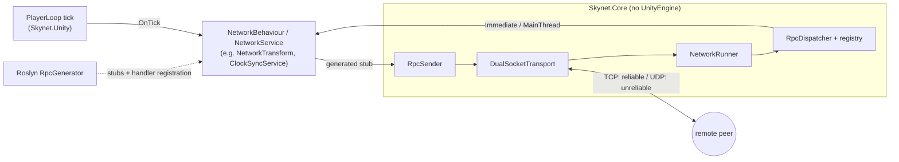

# Skynet <sub>(repository: NetCodeFramework)</sub>
<!-- screenshot: docs/images/skynet-demo.png -->


A client-server multiplayer framework for Unity 6, written from scratch in C#: a dual-socket transport on raw
`System.Net.Sockets`, compile-time RPC produced by a Roslyn source generator, and tick-based state sync with snapshot
interpolation. The runtime core has no `UnityEngine` dependency; Unity is plugged in through thin adapters.

## Features

**Transport: `DualSocketTransport`**
- TCP for reliable traffic (length-prefixed frames, 64 KB payload cap) and UDP for high-frequency state, both on IPv6 dual-stack sockets.
- The server assigns each client an id in a TCP handshake; the client's first UDP datagram binds its UDP endpoint.
- Bounded send queues per connection (`System.Threading.Channels`, many writers, one sender loop). On overflow, TCP rejects the new packet with a warning instead of growing without limit; UDP drops the oldest packet so stale state rolls off.
- Packet buffers are rented from `ArrayPool<byte>` on both the send and receive paths.
- Async shutdown is safe to trigger from Unity's main thread (no sync-context deadlock on play-mode exit).
- Everything sits behind `ITransport`, so the RPC layer never touches sockets.

**Source-generated RPC**
- Mark methods of a `partial` `NetworkBehaviour` or `NetworkService` with `[ServerRpc]` / `[ClientRpc]`; an incremental Roslyn generator emits handler registration and typed send stubs. Handlers are plain delegates, with no reflection-based lookup.
- Stable wire ids: FNV-1a over the type name and full method signature, emitted as `const int`s.
- Typed payloads serialized with MessagePack (several parameters are packed as one tuple).
- Per-RPC options: protocol (TCP/UDP), handler thread (`MainThread` by default, or `Immediate` on the network thread) and, for `[ClientRpc]`, target (all clients or one).
- Optional leading `int senderId` parameter. It is left out of the stub, and on the server it is filled from the transport's client id, not from the id the client wrote into the message.

**Simulation and sync**
- Fixed-rate network tick injected into Unity's PlayerLoop (start of `Update`, no scene object): 1-240 Hz, default 30, with a clamp against catch-up spirals after a hitch.
- NTP-style clock sync: UDP ping/pong every 30 ticks, one-way delay estimated as RTT/2, and a smoothed tick offset that gives clients `CurrentServerTick`.
- `NetworkTransform`: the owner sends only the components that changed past a threshold (position/rotation/scale flags), a full keyframe every 30 ticks, and a teleport flag for snaps. Receivers buffer snapshots, render 2 ticks behind server time with interpolation, and fall back to velocity extrapolation capped at 2 ticks. All of these are per-component inspector settings.
- Server-side spawning and despawning from a prefab registry; clients that join late receive every live object on connect.
- Object ownership: each `NetworkObject` is owned by the server or by a client (`OwnerClientId`, `IsOwner`), and the owner id passed to `Spawn` is replicated to every client. The owner drives the object's transform; client-owned updates are relayed through the server.

## Architecture



`Skynet.Core` is an asmdef with `noEngineReferences`; its sources are also shared into a netstandard2.1 SDK project
(`src/Skynet.Core`), the starting point for a headless .NET server. `Skynet.Unity` holds the PlayerLoop tick scheduler,
`SynchronizationContext` main-thread dispatcher, logger and MessagePack formatters (`Vector3`, `Quaternion`, snapshots),
plugged into Core through `INetworkTickScheduler`, `IMainThreadDispatcher` and `ISkynetLogger`. VContainer wires it up.

## Usage

Illustrative example (not in the repo), written to the generator's actual rules. In-repo examples:
`ClockSyncService`, `NetworkTransform` and `NetworkSpawner`.

```csharp
using Skynet.Data.Attributes;                 // [ServerRpc], [ClientRpc]
using Skynet.NetworkComponents.RpcComponents; // NetworkBehaviour
using Skynet.RpcSystem;                       // RpcTarget, HandlerExecution
using Skynet.RpcSystem.ProcessorsData;        // NetProtocolType
using UnityEngine;

public partial class Chat : NetworkBehaviour   // partial: the generator adds the other half
{
    // Client -> server (TCP, main thread by default). `senderId` is filled in by the server.
    [ServerRpc]
    private void HandleSay(int senderId, string text)
    {
        Announce(senderId, text);                // generated: broadcast to all clients
        if (text == "/ping") Pong(senderId);     // generated: send to one client
    }

    // Server -> all clients.
    [ClientRpc]
    private void HandleAnnounce(int author, string text) => Debug.Log($"[{author}] {text}");

    // Server -> one client, over UDP, handled directly on the network thread.
    [ClientRpc(NetProtocolType.Udp, RpcTarget.Client, HandlerExecution.Immediate)]
    private void HandlePong() => Debug.Log("pong");

    public void Submit(string text) => Say(text); // client side: call the generated stub
}
```

Each stub is named by stripping the `Handle` prefix; a method without the prefix gets an `Rpc` suffix instead
(`Foo` becomes `FooRpc`). Generated code for the class above, abridged:

```csharp
partial class Chat
{
    protected override void RegisterHandlers() { /* HandleSay, HandleAnnounce, HandlePong */ }

    public void Say(string text) { /* RpcSender.SendToServer(...), TCP */ }
    public void Announce(int author, string text) { /* RpcSender.BroadcastToClients(...), TCP */ }
    public void Pong(int clientId) { /* RpcSender.SendToClient(clientId, ...), UDP */ }
}
```

Put the behaviour on a prefab with a `NetworkObject` (list it in the object's behaviours or enable *Need To Collect
Behaviours*), add the prefab to `NetworkObjectsConfig`, and spawn it on the server with `INetworkSpawner.Spawn(...)`.
Instance ids come from the server-assigned object id, component type and index, so an RPC hits the same component on every peer.

## Getting started

**Requirements:** Unity **6000.4.5f1**. Dependencies are committed: VContainer, UniTask, MessagePack 3.1.1 (via
NuGetForUnity), System.Threading.Channels, ParrelSync. A .NET SDK is needed only to rebuild the generator.

1. Open the project in Unity 6000.4.5f1 and load `Assets/Scenes/Bootstrap.unity`.
2. **Server:** the `SERVER` scripting define is set for the Standalone target (*Player Settings > Scripting Define Symbols*),
   and `Bootstrapper` checks it with `#if SERVER`. Press Play: the server listens on TCP 5055 / UDP 5057 and spawns two demo cubes.
3. **Client:** open a second editor with ParrelSync (*ParrelSync > Clones Manager*). Clones share `ProjectSettings`, and
   defines are stored per build target, so switch the clone to a target that doesn't define `SERVER`. Press Play: the
   client connects to `127.0.0.1`, gets its id from the handshake, and receives the existing objects.

Ports and addresses for the demo are set in `Assets/_Scripts/Infrastructure/Bootstrapper.cs`.

**Rebuilding the source generator** (after editing `src/Skynet.SourceGenerators/RpcGenerator.cs`):

```bash
bash src/rebuild-generators.sh
```

The script builds the generator in Release (netstandard2.0) using `$DOTNET`, `~/.dotnet/dotnet` or `dotnet` on `PATH`,
then copies the DLL to `Assets/Skynet/Runtime/Generators/`; Unity reimports it when the editor regains focus. The
generator is pinned to Roslyn 4.3 to match Unity's bundled compiler, which won't load generators built on a newer one.

## Project layout

| Path | Contents |
|---|---|
| `Assets/Skynet/Runtime/Core` | Engine-agnostic runtime: transport, RPC pipeline, runner, tick and clock sync, snapshot buffer |
| `Assets/Skynet/Runtime/Unity` | Unity adapters: PlayerLoop tick, main-thread dispatcher, logger, MessagePack formatters |
| `Assets/Skynet/Runtime/Generators` | Prebuilt generator DLL, imported by Unity as a Roslyn analyzer |
| `Assets/_Scripts/Netcore` | `NetworkObject`, `NetworkBehaviour`, `NetworkTransform`, `NetworkSpawner`, objects container |
| `Assets/_Scripts/Infrastructure` | VContainer installer and the `Bootstrapper` demo entry point |
| `src/Skynet.SourceGenerators` | Incremental Roslyn RPC generator |
| `src/Skynet.Core` | netstandard2.1 SDK project that shares the Core sources |

## Status and roadmap

Skynet is under active development against the demo scene. Next:

- Client-side prediction and server reconciliation
- Bit-packing and quantization for snapshots
- Interest management (per-client relevance)
- A reliable channel over UDP
- A headless .NET server on `src/Skynet.Core` (first step: wiring the generator into that project)
- Moving `NetworkVariable<T>` and `NetworkRigidbody` onto the generated-RPC pipeline
- Automated tests for the transport, RPC routing and snapshot buffer

## License

Apache License 2.0. See [LICENSE](LICENSE).

Author: Artur Zheldakov ([@anon121213](https://github.com/anon121213))
